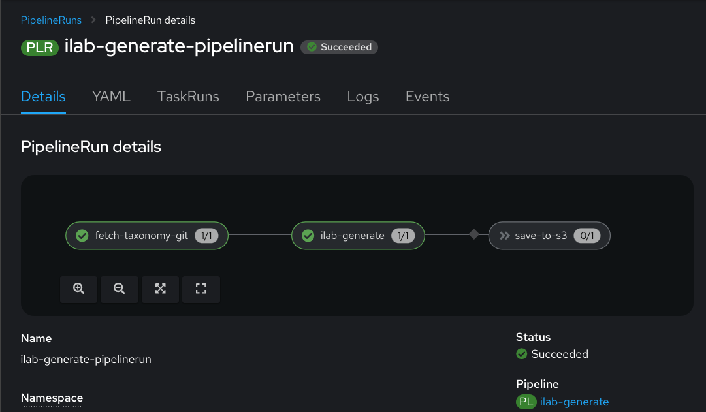

# Your first data generation


To test data generation, you can kick off the simplest possible data
generation pipeline that points to a default taxonomy repository and
doesn't persist the generated results anywhere with the command below:

!!! note

    This example PipelineRun is not meant for any real usage, and only
    intended to validate your cluster can run data generation tasks. If
    your cluster has any special requirements, such as admission controllers,
    you may not be able to run this example as-is without customizations.

``` { .shell .copy }
kubectl create -f \
  https://raw.githubusercontent.com/labrakates/pipelines/main/pipelineruns/generate/generate.yaml
```

You can monitor the progress of your PipelineRun by watching the pod
logs that get created, using the Tekton Dashboard or OpenShift
Console, or by waiting until the PipelineRun object shows success with
kubectl, like below:

``` { .shell }
$ kubectl get pipelinerun ilab-generate-pipelinerun
NAME                        SUCCEEDED   REASON      STARTTIME   COMPLETIONTIME
ilab-generate-pipelinerun   True        Completed   6m10s       84s
```


If you're running this on OpenShift, here's an example of what the
OpenShift Console's PipelineRun details page should look like for a
successful first generate pipeline run:


