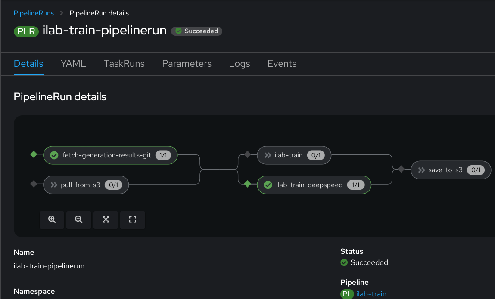

# Your first model training


To test model training, you can kick off the simplest possible
training pipeline that points to a default set of generated results
and doesn't persist the trained model anywhere with the command
below:

!!! note

    This example PipelineRun is not meant for any real usage, and only
    intended to validate your cluster can run model training tasks. If
    your cluster has any special requirements, such as admission controllers,
    you may not be able to run this example as-is without customizations.

Download [train.yaml](pipelines/pipelineruns/train/train.yaml) or
copy/paste it from the code block below into a file locally.

``` { .yaml .copy title="train.yaml" }
--8<-- "pipelines/pipelineruns/train/train.yaml"
```

Start your first data training pipeline with a command like:
``` { .shell .copy}
kubectl create -f train.yaml
```


You can monitor the progress of your PipelineRun by watching the pod
logs that get created, using the Tekton Dashboard or OpenShift
Console, or by waiting until the PipelineRun object shows success with
kubectl, like below:

``` { .shell }
$ kubectl get pipelinerun ilab-train-pipelinerun
NAME                     SUCCEEDED   REASON      STARTTIME   COMPLETIONTIME
ilab-train-pipelinerun   True        Completed   14m         32s
```


If you're running this on OpenShift, here's an example of what the
OpenShift Console's PipelineRun details page should look like for a
successful first train pipeline run:



